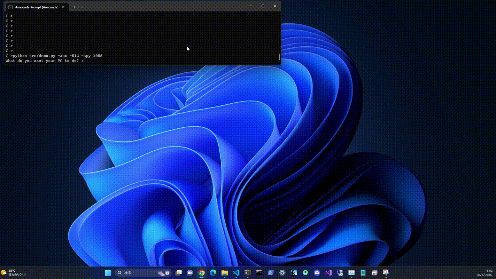

# GUI operation sample by ChatGPT and PyAutoGUI

Sample code of GUI operation by natural language using ChatGPT(gpt-3.5-turbo) and PyAutoGUI.  
In this sample code, ChatGPT opens Notepad and writes the specified contents.

## Build environment

```
$ pip install pyautogui
$ pip install openai
$ export OPENAI_API_KEY=(Your OPENAI API key)
```

## Run sample code

1. Get the current mouse coordinates on the screen.  
    After running the program, hover your mouse over the Notepad app on the taskbar.  
    ```
    $ python src/show_mouse_posi.py
    Current mouse position : x = -1156, y = 42
    Current mouse position : x = -2524, y = 185
    ...
    ```
2. Command ChatGPT to write the specified contents to Notepad.  
    Note that the mouse behaves on its own when you run this code.  
    ```
    $ python src/demo -apx (X coordinate obtained in Step1.) -apy (Y coordinate obtained in Step1.)
    What do you want your PC to do? : Write an introduction to ChatGPT in Notepad.
    ```
    Contents of processing performed by the program.  
    1. Wait for a instruction to ChatGPT.
    1. For instructions to the Notepad app, move the mouse over the Notepad app.
    1. Performs a left mouse click.
    1. Write the sentences created by ChatGPT to the notepad application.

## Result

